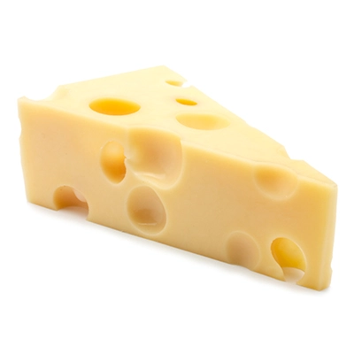

# Cheese

## Simple cross-platform command line parser for zig applications

It targets the ease of usage: 

- single function call to get args
- flexible parsing
- small amount of code

## Currently in development
